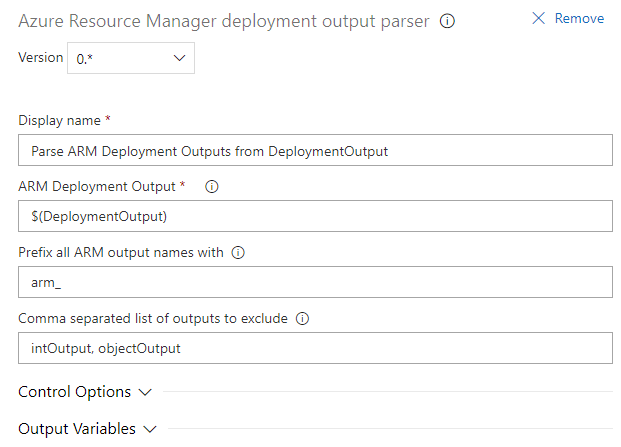
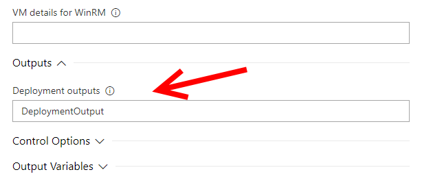

# Azure Resource Manager deployment output to pipeline variable converter

This extension for Azure DevOps (aka VSTS) Release Pipelines is a task which
converts Azure Resource Manager (ARM) template outputs to variables that can
be used in the remaining pipeline tasks.

## Configure

The task has these inputs:

* Display name
  * Task display name shown in the release log
* ARM Deployment Output
  * The variable that was used in the ARM deployment tasks's "Deployment Outputs"
  setting.[1](#ARM-deployment-task)
* Prefix all ARM output names with
  * The variables names that are generated will be prepended with this string.
* Comma separated list of outputs to exclude
  * The ARM template outputs that are listed here are NOT converted to pipeline variables.

### ARM deployment task

The ARM deployment task in Azure DevOps Pipelines has a lot of inputs.

Near the bottom of the task settings is the "Deployment Outputs" heading. The
name you enter here, will become the variable name that must be used in the
ARM deployment output parser's "ARM Deployment Output" setting.

## FAQ

Q: The variables don't show up in other agent jobs. How come?

A: Variables that are set in one agent job in the pipeline are not transferred
to other agent jobs in the same pipeline. That is an Azure DevOps
[limitation](https://docs.microsoft.com/en-us/azure/devops/pipelines/release/variables?view=vsts&tabs=batch#set-in-script).

Q: SecureString and SecureObject ARM outputs don't work. Why?

A: They are not output by the ARM deployment task in Azure DevOps, and thus
cannot be read by this task.

## Security

The extension marks all variable contents as "secret" in Azure DevOps Services.
This means that the variable values don't show up in the release logs.

The extension does not store or transfer or otherwise leak your ARM Output.
The full extension source is available on
[the GitHub project page](https://github.com/rwatjen/ARMOutputParserVSTSExtension).
